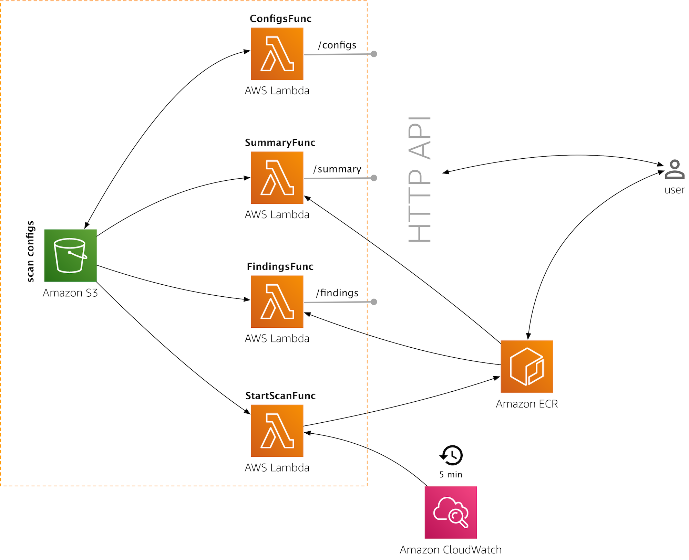

# ECR Continuous Image Scanning

This repo shows how to use the [ECR image scanning](https://docs.aws.amazon.com/AmazonECR/latest/userguide/security.html) feature
for a scheduled re-scan, that is, scanning images on a regular basis. We will walk you through the setup and usage of this demo.

## Installation

In order to build and deploy the service, clone this repo and make sure you've got the following available, locally:

- The [aws](https://docs.aws.amazon.com/cli/latest/userguide/cli-chap-install.html) CLI
- The [SAM CLI](https://github.com/awslabs/aws-sam-cli)
- Go 1.12 or above

Additionally, having [jq](https://stedolan.github.io/jq/download/) installed it recommended.

Preparing the S3 buckets (make sure that you pick different names for the `ECR_SCAN_*` buckets):

```sh
export ECR_SCAN_SVC_BUCKET=ecr-continuous-scan-svc
export ECR_SCAN_CONFIG_BUCKET=ecr-continuous-scan-config

aws s3api create-bucket \
            --bucket $ECR_SCAN_SVC_BUCKET \
            --create-bucket-configuration LocationConstraint=$(aws configure get region) \
            --region $(aws configure get region)

aws s3api create-bucket \
            --bucket $ECR_SCAN_CONFIG_BUCKET \
            --create-bucket-configuration LocationConstraint=$(aws configure get region) \
            --region $(aws configure get region)
```

Make sure that you have the newest [Go SDK](https://aws.amazon.com/sdk-for-go/) installed, 
supporting the image scanning feature. In addition, you need to `go get https://github.com/gorilla/feeds`
as the one other dependency outside of the standard library. Then execute:

```sh
make deploy
``` 

which will build the binaries and deploy the Lambda functions. 

You're now ready to use the demo.


## Architecture

The overall architecture of the demo is as follows:



There are four Lambda functions and an S3 buckets to hold the scan configurations involved.

The HTTP API is made up of the following three Lambda functions:

* `ConfigsFunc` handles the management of scan configs, allowing you to store, list, and delete them.
* `SummaryFunc` provides a summary of the scan findings across all scan configs.
* `FindingsFunc` provides a detailed Atom feed of the scan findings per scan config.

In addition, there is a `StartScanFunc` that is triggered by a CloudWatch event, kicking off the image scan.

### Scan configurations

To specify which repositories should be re-scanned on a regular basis, one has to provide a scan configuration.

This scan configuration has three required fields, `region`, `registry` (your AWS account ID), and
the `repository` itself: 

```json
{
    "region": "us-west-2",
    "registry": "123456789012",
    "repository": "amazonlinux",
    "tags": [
        "2018.03"
    ]
}
```

Note that `tags` is optional and if not provided, all tags of the `repository` will be scanned. 

### API

The following HTTP API is exposed:

Scan configurations:

* `GET configs/` … lists all registered scan configurations, returns JSON
* `POST configs/` … adds a scan configuration, returns scan ID
* `DELETE configs/{scanid}` … removes a registered scan configuration by scan ID or `404` if it doesn't exist

Scan findings:

* `GET summary/` … provides high-level summary of findings across all registered scan configurations
* `GET findings/{scanid}` … provides detailed findings on a scan configuration bases, returns an Atom feed


## Usage walkthrough

Capture the base HTTP API:

```sh
export ECRSCANAPI_URL=$(aws cloudformation describe-stacks --stack-name ecr-continuous-scan | jq '.Stacks[].Outputs[] | select(.OutputKey=="ECRScanAPIEndpoint").OutputValue' -r)
```

Add some scan configurations:

```sh
curl -s --header "Content-Type: application/json" --request POST --data @scan-config-amazonlinux.json $ECRSCANAPI_URL/configs/
curl -s --header "Content-Type: application/json" --request POST --data @scan-config-centos.json $ECRSCANAPI_URL/configs/
curl -s --header "Content-Type: application/json" --request POST --data @scan-config-ubuntu.json $ECRSCANAPI_URL/configs/
```

List all registered scan configurations:

```sh
$ curl $ECRSCANAPI_URL/configs/
[
  {
    "id": "4471c156-29f5-40fe-883b-3cd26738d5a6",
    "created": "1569927812",
    "region": "us-west-2",
    "registry": "123456789012",
    "repository": "amazonlinux",
    "tags": [
      "2018.03"
    ]
  },
  {
    "id": "612fccea-9545-45d0-8feb-cdc20c4c3061",
    "created": "1569927820",
    "region": "us-west-2",
    "registry": "123456789012",
    "repository": "test/centos",
    "tags": null
  },
  {
    "id": "fc41dda8-f15e-4826-8908-11603b01dac4",
    "created": "1569927828",
    "region": "us-west-2",
    "registry": "123456789012",
    "repository": "test/ubuntu",
    "tags": [
      "16.04",
      "latest"
    ]
  }
]
```

Get an overview of the scan result findings

```sh
$ curl $ECRSCANAPI_URL/summary
Results for amazonlinux:2018.03 in us-west-2:


Results for test/centos:7 in us-west-2:
 HIGH: 7
 LOW: 7
 MEDIUM: 20


Results for test/ubuntu:16.04 in us-west-2:
 INFORMATIONAL: 19
 LOW: 24
 MEDIUM: 8


Results for test/ubuntu:latest in us-west-2:
 MEDIUM: 7
 INFORMATIONAL: 9
 LOW: 13
```

Get a detailed feed of findings for `test/ubuntu` (with scan ID `fc41dda8-f15e-4826-8908-11603b01dac4`):

```sh
$ curl $ECRSCANAPI_URL/findings/fc41dda8-f15e-4826-8908-11603b01dac4
<?xml version="1.0" encoding="UTF-8"?>
<feed xmlns="http://www.w3.org/2005/Atom">
  <title>ECR repository test/ubuntu in us-west-2</title>
  <id>https://us-west-2.console.aws.amazon.com/ecr/repositories/test/ubuntu/</id>
  <updated></updated>
  <subtitle>Details of the image scan findings across the tags: [16.04] [latest] </subtitle>
  <link href="https://us-west-2.console.aws.amazon.com/ecr/repositories/test/ubuntu/"></link>
  <author>
    <name>ECR</name>
  </author>
  <entry>
    <title>[MEDIUM] in image test/ubuntu:16.04 found CVE-2016-1585</title>
    <updated>2019-10-01T11:27:17Z</updated>
    <id>16.04</id>
    <link href="http://people.ubuntu.com/~ubuntu-security/cve/CVE-2016-1585" rel="alternate"></link>
    <summary type="html">In all versions of AppArmor mount rules are accidentally widened when compiled.</summary>
  </entry>
  ...
</feed>  
```

The Atom feeds can be consumed in a feed reader, for example:


You can remove scan configs like so:

```sh
curl --request DELETE $ECRSCANAPI_URL/configs/4471c156-29f5-40fe-883b-3cd26738d5a6
```
